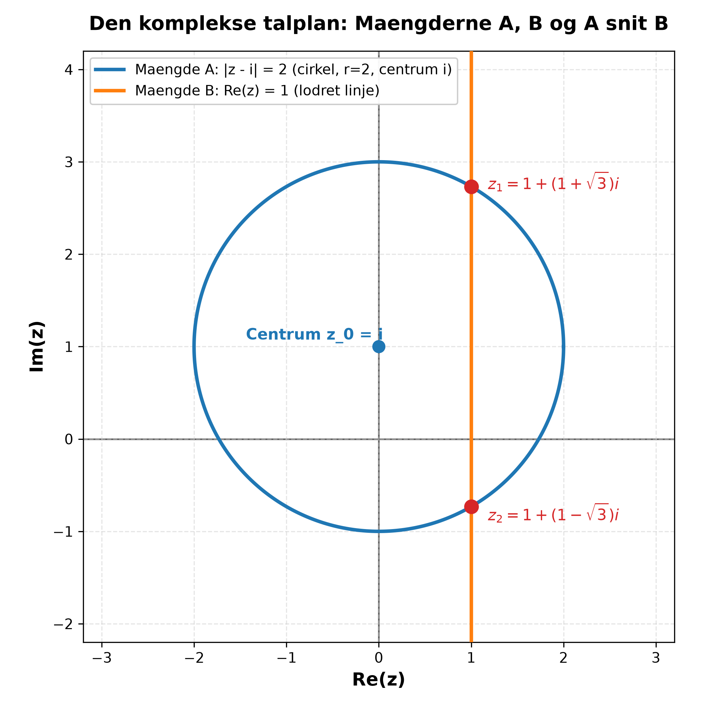

# Aflevering 1: Matematik 1A

Hjemmeopgave 1 til Matematik 1A. Alle delopgaver er gennemregnet og forklaret trin for trin.

## Opgave a)

> Afgør om følgende to logiske udsagn er logisk ækvivalente:
>
> $$(P \Leftrightarrow Q) \land P \quad \text{og} \quad P \Rightarrow Q$$

To udsagn er logisk ækvivalente netop hvis de har samme sandhedsværdi for samtlige kombinationer af sandhedsværdier for de indgående variable $P$ og $Q$.

Vi opstiller en sandhedstabel for begge udsagn:

| $P$ | $Q$ | $P \Leftrightarrow Q$ | $(P \Leftrightarrow Q) \land P$ | $P \Rightarrow Q$ |
| :-: | :-: | :-------------------: | :-----------------------------: | :---------------: |
|  S  |  S  |           S           |                S                |         S         |
|  S  |  F  |           F           |                F                |         F         |
|  F  |  S  |           F           |                F                |       **S**       |
|  F  |  F  |           S           |                F                |       **S**       |

Sammenligner vi de to sidste kolonner, ser vi en klar uoverensstemmelse i de to nederste rækker, hvor $P$ er falsk:

1. Hvis $P$ er falsk ($P = \text{F}$) og $Q$ er sand ($Q = \text{S}$), er $(P \Leftrightarrow Q) \land P$ falsk, mens $P \Rightarrow Q$ er sand.
2. Hvis både $P$ og $Q$ er falske ($P = \text{F}$ og $Q = \text{F}$), er $(P \Leftrightarrow Q) \land P$ falsk, mens $P \Rightarrow Q$ er sand.

Faktisk kan det første udsagn reduceres direkte: $(P \Leftrightarrow Q) \land P$ er ækvivalent med $P \land Q$. Det kræver altså at både $P$ og $Q$ er sande. Implikationen $P \Rightarrow Q$ kræver derimod blot, at vi ikke har sandt til venstre og falsk til højre, så den er automatisk sand whenever $P$ er falsk.

Da sandhedsværdierne adskiller sig når $P = \text{F}$, er udsagnene ikke ens.

**Konklusion: Udsagnene er ikke logisk ækvivalente.**

---

## Opgave b)

> Givet funktionen
>
> $$f : \mathbb{R} \to \mathbb{R} \quad \text{med forskriften} \quad f(x) = x^2 - 3x + 2 - 3 \cdot |x - 1|.$$
>
> 1. Afgør om funktionen er injektiv.
> 2. Beregn funktionens værdimængde.

Først deler vi forskriften op efter numerisk-tegnet. Skillepunktet er $x = 1$:

- For $x \ge 1$ gælder $|x - 1| = x - 1$. Forskriften bliver:
  $$f(x) = x^2 - 3x + 2 - 3(x - 1) = x^2 - 6x + 5$$
  Bemærk at $x^2 - 6x + 5 = (x - 1)(x - 5)$.

- For $x < 1$ gælder $|x - 1| = -(x - 1) = 1 - x$. Forskriften bliver:
  $$f(x) = x^2 - 3x + 2 - 3(1 - x) = x^2 - 3x + 2 - 3 + 3x = x^2 - 1$$
  Bemærk at $x^2 - 1 = (x - 1)(x + 1)$.

Samlet set er $f(x)$ stykkevis defineret som:

$$f(x) = \begin{cases} x^2 - 6x + 5, & x \ge 1 \\ x^2 - 1, & x < 1 \end{cases}$$

I overgangspunktet $x = 1$ har vi $f(1) = 1^2 - 6(1) + 5 = 0$, og fra venstre går $x^2 - 1 \to 0$ for $x \to 1$. Funktionen er altså kontinuert i hele $\mathbb{R}$.

### 1. Injektivitet

En funktion $f$ er injektiv, hvis der for alle $x_1, x_2 \in \mathbb{R}$ gælder:

$$f(x_1) = f(x_2) \implies x_1 = x_2$$

Hvis vi kan finde to forskellige $x$-værdier med samme funktionsværdi, er $f$ ikke injektiv.

Lad os kigge på funktionens nulpunkter:
- For $x \ge 1$ giver $x^2 - 6x + 5 = 0$ rødderne $x = 1$ og $x = 5$.
- For $x < 1$ giver $x^2 - 1 = 0$ roden $x = -1$ (den anden rod $x = 1$ tilhører det andet interval).

Vi kan derfor udregne funktionsværdierne direkte:
- $f(-1) = (-1)^2 - 1 = 0$
- $f(1) = 1^2 - 6(1) + 5 = 0$
- $f(5) = 5^2 - 6(5) + 5 = 0$

Her har vi tre forskellige punkter, $-1$, $1$ og $5$, som alle afbildes i $0$:

$$f(-1) = f(1) = f(5) = 0 \quad \text{hvor} \quad -1 \ne 1 \ne 5$$

Dermed er kravet for injektivitet brudt.

**Konklusion: Funktionen $f$ er ikke injektiv.**

### 2. Værdimængde

Funktionen er defineret på hele $\mathbb{R}$. Vi analyserer ekstrema for de to grene:

1. Grenen for $x < 1$: $f(x) = x^2 - 1$.
   Grafen er en opadskånende parabel med toppunkt i $x = 0$.
   Toppunktets værdi er $f(0) = 0^2 - 1 = -1$.
   Når $x \to -\infty$, vokser $x^2 - 1 \to +\infty$.
   Når $x \to 1^-$, nærmer $f(x)$ sig $1^2 - 1 = 0$.
   Værdimængden for denne gren alene er intervallet $\lbrack -1, \infty)$.

2. Grenen for $x \ge 1$: $f(x) = x^2 - 6x + 5$.
   Dette er ligeledes en opadvendende parabel. Vi finder toppunktet ved at omskrive til kvadratkomplettering:
   $$f(x) = (x - 3)^2 - 9 + 5 = (x - 3)^2 - 4$$
   Toppunktet ligger i $x = 3$. Da $3 \ge 1$, ligger punktet i grenens definitionsområde.
   Toppunktets funktionsværdi er:
   $$f(3) = (3 - 3)^2 - 4 = -4$$
   Når $x \to +\infty$, vokser $f(x) \to +\infty$.
   Værdimængden for denne gren er derfor $\lbrack -4, \infty)$.

Da hele funktionens værdimængde er foreningen af de to grens værdimængder:

$$\mathrm{Vm}(f) = \lbrack -1, \infty) \cup \lbrack -4, \infty) = \lbrack -4, \infty)$$

Globalt minimum er altså $-4$, opnået i $x = 3$. Da $f$ er kontinuert og vokser mod uendelig for $x \to \pm\infty$, antager $f$ alle værdier fra og med $-4$ og opefter.

**Konklusion: Funktionens værdimængde er $\mathrm{Vm}(f) = \lbrack -4, \infty) = \{y \in \mathbb{R} \mid y \ge -4\}$.**

## Opgave c)

> Der opgives følgende to delmængder af de komplekse tal:
>
> $$A = \{z \in \mathbb{C} \mid |z - i| = 2\} \quad \text{og} \quad B = \{z \in \mathbb{C} \mid \mathrm{Re}(z) = 1\}$$
>
> 1. Indtegn mængderne $A$ og $B$ i den komplekse talplan.
> 2. Beregn $A \cap B$.

### 1. Geometrisk beskrivelse og indtegning

Vi skriver $z = x + iy$ med $x, y \in \mathbb{R}$.

- **Mængde $A$:**
  Ligningen $|z - i| = 2$ udtrykker, at afstanden fra det komplekse tal $z$ til tallet $i = 0 + 1i$ er præcis $2$.
  I den komplekse talplan svarer dette til en cirkel med centrum i $z_0 = i$, altså punktet $(0, 1)$, og radius $r = 2$.
  På koordinatform:
  $$|x + i(y - 1)| = 2 \iff \sqrt{x^2 + (y - 1)^2} = 2 \iff x^2 + (y - 1)^2 = 4$$

- **Mængde $B$:**
  Kravet $\mathrm{Re}(z) = 1$ betyder, at realdelen af $z$ er fastlåst til $1$, mens imaginærdelen $y$ kan være hvad som helst.
  Dette er en lodret ret linje parallel med den imaginære akse gennem punktet $(1, 0)$.

Nedenfor er mængderne indtegnet i den komplekse talplan sammen med deres skæringspunkter:

### 2. Beregning af $A \cap B$

Skæringsmængden $A \cap B$ består af de tal $z = x + iy$, der opfylder begge betingelser samtidigt.

Da $z \in B$, er $x = 1$. Vi indsætter $x = 1$ i cirklens ligning fra mængde $A$:

$$1^2 + (y - 1)^2 = 4$$

$$(y - 1)^2 = 4 - 1 = 3$$

Vi tager kvadratroden på begge sider:

$$y - 1 = \pm\sqrt{3} \implies y = 1 \pm \sqrt{3}$$

Dette giver netop to imaginærdele:
- $y_1 = 1 + \sqrt{3}$
- $y_2 = 1 - \sqrt{3}$

Da $x = 1$, finder vi de to komplekse tal:

$$z_1 = 1 + (1 + \sqrt{3})i \quad \text{og} \quad z_2 = 1 + (1 - \sqrt{3})i$$

**Konklusion:**

$$A \cap B = \big\{1 + (1 + \sqrt{3})i, \; 1 + (1 - \sqrt{3})i\big\}$$

## Opgave d)

> Vis at det komplekse tal $(1 - i)^{80}$ er et reelt tal.

Vi kan vise dette på to forskellige måder: via polær form (de Moivres formel) og via direkte potensregning.

### Metode 1: Polær form

Lad $w = 1 - i$. Vi omskriver $w$ til polær form $w = r e^{i\theta}$:

1. Modulus (absolutværdi):
   $$r = |w| = \sqrt{1^2 + (-1)^2} = \sqrt{2}$$

2. Hovedargument:
   Realdelen er positiv ($\mathrm{Re}(w) = 1 > 0$) og imaginærdelen er negativ ($\mathrm{Im}(w) = -1 < 0$), så tallet ligger i 4. kvadrant:
   $$\theta = \mathrm{Arg}(w) = -\frac{\pi}{4}$$

Dermed er:

$$w = \sqrt{2} e^{-i\pi/4}$$

Nu opløfter vi til 80. potens:

$$(1 - i)^{80} = \left(\sqrt{2} e^{-i\pi/4}\right)^{80} = \left(\sqrt{2}\right)^{80} \cdot e^{-i \cdot 80 \cdot \frac{\pi}{4}}$$

Vi udregner de to faktorer hver for sig:
- Modulusfaktoren:
  $$\left(\sqrt{2}\right)^{80} = \left(2^{1/2}\right)^{80} = 2^{40}$$
- Vinkelfaktoren:
  $$e^{-i \cdot 80 \cdot \frac{\pi}{4}} = e^{-i 20\pi} = \cos(-20\pi) + i\sin(-20\pi)$$

Da $-20\pi$ er et lige multiplum af $\pi$ (nemlig $-10 \cdot 2\pi$), har vi:
$$\cos(-20\pi) = 1 \quad \text{og} \quad \sin(-20\pi) = 0$$

Altså er $e^{-i 20\pi} = 1$.

Vi samler udtrykket:

$$(1 - i)^{80} = 2^{40} \cdot 1 = 2^{40}$$

Da $2^{40} = 1.099.511.627.776$ er et almindeligt positivt tal uden nogen imaginærdel ($\mathrm{Im}((1-i)^{80}) = 0$), er tallet reelt.

### Metode 2: Potensregning med kvadrering

Vi kan også udregne kvadratet først:

$$(1 - i)^2 = 1 - 2i + i^2 = 1 - 2i - 1 = -2i$$

Nu udnytter vi potensen $80 = 2 \cdot 40$:

$$(1 - i)^{80} = \left((1 - i)^2\right)^{40} = (-2i)^{40} = (-2)^{40} \cdot i^{40}$$

Her er $(-2)^{40} = 2^{40}$, og for potenser af $i$ gælder:

$$i^{40} = (i^4)^{10} = 1^{10} = 1$$

Dermed får vi igen:

$$(1 - i)^{80} = 2^{40} \cdot 1 = 2^{40} \in \mathbb{R}$$

**Konklusion: $(1 - i)^{80} = 2^{40}$, hvilket er et reelt tal.**

## Opgave e)

> Som sædvanligt betegnes hovedargumentet af et komplekst tal $z$ med $\mathrm{Arg}(z)$. Afgør om følgende udsagn er sande:
>
> 1. $\mathrm{Arg}(z) = \pi \implies z \in \mathbb{R}_{<0}$
> 2. $z \in \mathbb{R} \implies \mathrm{Arg}(z) = 0$

Hovedargumentet $\mathrm{Arg}(z)$ for et komplekst tal $z \ne 0$ er pr. standarddefinition i Matematik 1A fastlagt i det halvåbne interval $(-\pi, \pi]$.

### 1. Vurdering af: $\mathrm{Arg}(z) = \pi \implies z \in \mathbb{R}_{<0}$

Lad $\mathrm{Arg}(z) = \pi$. På polær form kan ethvert komplekst tal $z$ skrives som:

$$z = r e^{i\theta} = r(\cos\theta + i\sin\theta)$$

hvor $r = |z| > 0$ og $\theta = \mathrm{Arg}(z)$.

Når $\theta = \pi$, indsætter vi:

$$z = r(\cos\pi + i\sin\pi) = r(-1 + 0i) = -r$$

Da $r > 0$, er $-r$ et strengt negativt reelt tal. Det vil sige:

$$z \in \mathbb{R}_{<0}$$

Omvendt gælder det også, at ethvert negativt reelt tal ligger på den negative del af den reelle akse i vinklen $\pi$. Implikationen holder derfor i alle tilfælde.

**Konklusion: Udsagn 1 er sandt.**

### 2. Vurdering af: $z \in \mathbb{R} \implies \mathrm{Arg}(z) = 0$

Udsagnet hævder, at alle reelle tal har hovedargument $0$. Det er ikke sandt.

Vi betragter et simpelt modeksempel:
Lad $z = -1$.
Tallet $-1$ er et reelt tal, så forudsætningen $z \in \mathbb{R}$ er opfyldt.
Men som vist i del 1 ligger de negative reelle tal i retningen mod venstre i talplanet, så:

$$\mathrm{Arg}(-1) = \pi \ne 0$$

Derudover er tallet $z = 0$ også reelt ($0 \in \mathbb{R}$), men for $z = 0$ er argumentet slet ikke veldefineret, idet $0$ ikke har nogen bestemt retning i talplanet.

Kun de strengt positive reelle tal $z \in \mathbb{R}_{>0}$ har $\mathrm{Arg}(z) = 0$. For alle andre tal i $\mathbb{R}$ er påstanden forkert.

**Konklusion: Udsagn 2 er falsk (et modeksempel er $z = -1$, hvor $\mathrm{Arg}(-1) = \pi \ne 0$).**

## Samlet facitliste

- **a)** Udsagnene er **ikke logisk ækvivalente** (de afviger når $P = \text{F}$).
- **b1)** Funktionen $f$ er **ikke injektiv** (f.eks. $f(-1) = f(1) = f(5) = 0$).
- **b2)** Værdimængden er **$\mathrm{Vm}(f) = \lbrack -4, \infty)$**.
- **c1)** $A$ er en cirkel med centrum $(0, 1)$ og radius $2$. $B$ er den lodrette linje $x = 1$. (Se figur ovenfor).
- **c2)** $A \cap B = \big\{1 + (1 + \sqrt{3})i, \; 1 + (1 - \sqrt{3})i\big\}$.
- **d)** $(1 - i)^{80} = 2^{40} \in \mathbb{R}$, altså et **reelt tal**.
- **e1)** Udsagnet er **sandt**.
- **e2)** Udsagnet er **falsk** (modeksempel: $z = -1 \in \mathbb{R}$ har $\mathrm{Arg}(-1) = \pi \ne 0$).
